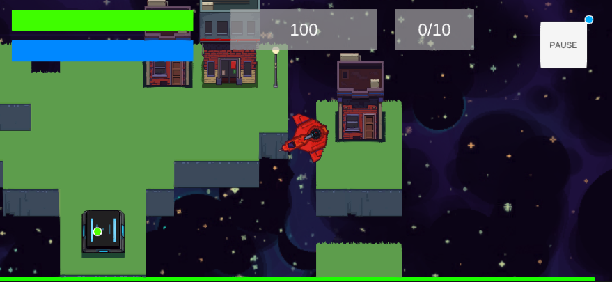

# Evacuation

Evacuation is a rescue shoot-em all game where you fly your pixel vessel around the local system in space and transport evacuees to the drop ship. However it is not all that easy, meanwhile a shockwave is heading to your position with multiple aliens invading your area of space. Thus you must both save and fight off the other worldly invaders. 

This game is developed for both gameplay in Desktop and for iOS 



### Prerequisites

What things you need to install the software and how to install them

```
* Unity 2020.2.1f1
```

## Built With

* [Unity](https://unity.com/) - Link to Unity Technologies page

## Authors

* **Jaiden Chicote** - *Initial work* - [jChicote](https://github.com/jChicote)

## License

No license is applied to this repository

## Acknowledgments

* Hat tip to anyone whose code was used
* Inspiration
* etc
